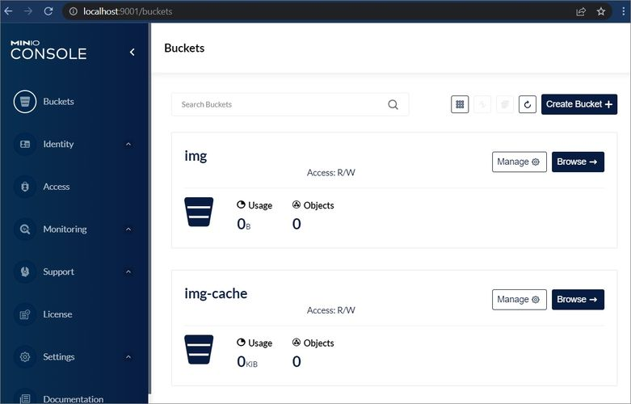

# Read-from-S3-cache-to-S3
### Use S3 storage as a source for images and another S3 storage to store cached results

1. Take a look at [`docker-compose.yml`](./docker-compose.yml) example file, copy it to your machine.
2. Run command `docker-compose up --build --no-deps --detach --remove-orphans` to spin up the containers.
3. Check that Thumbor container has started correctly by opening this url in your browser: http://localhost:8888/healthcheck  

Now we are going to use Minio as an example of working with AWS, because the configuration is quite similar.  
1. Open Mini web interface http://localhost:9001/ , log in using these credentials as Username and Password `admin`, `12345678`  
2. If everything was correct, you should see two buckets `img` and `img-cache`, they were set in `docker-compose.yml`  
     
3. Upload [this image](https://raw.githubusercontent.com/beeyev/thumbor-s3-docker/master/docs/img/yezhik.jpg) into the root of `img` bucket.  
     

Finally, we are going to see the magick ✩°｡⋆⸜    
Open this link http://localhost:8888/unsafe/600x600/yezhik.jpg , and you should see the resized image.  
Here is another example of functionality: http://localhost:8888/unsafe/300x400/filters:round_corner(20%7C20,0,0,0):brightness(5):contrast(40)/yezhik.jpg  
Take a look at [the official documentation](https://thumbor.readthedocs.io/en/stable/imaging.html) to learn more about image processing.  
  
The result cached images you can find inside the `img-cache` [bucket](http://localhost:9001/buckets/img-cache/browse/).  
